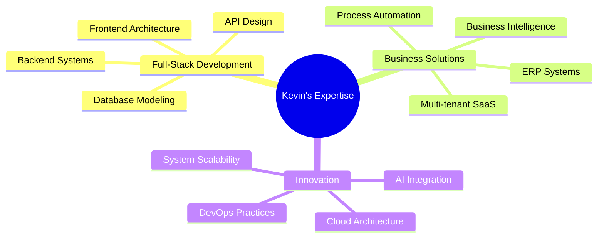

# 👨‍💻 Kevin Olaf Wildberger López

<div align="center">

[](https://git.io/typing-svg)


**`Computer Engineering Student | Independent Developer | ERP Solutions Architect`**

🎓 Studying Computer Engineering at **Polytechnic Faculty - National University of Asunción**  
🚀 Building **ELYGestión** - Next-gen ERP + AI for Latin American SMEs  
🌍 Based in **Villarrica, Paraguay**

</div>

---

## 🎯 About Me

I'm a passionate **Full-Stack Developer** and **Computer Engineering Student** dedicated to creating innovative digital solutions that empower businesses across Latin America. Currently developing **ELYGestión**, an integrated business management system that combines ERP functionality with adaptive AI to help SMEs optimize their operations.

```typescript
const kevin = {
    pronouns: "he/him",
    location: "Paraguay 🇵🇾",
    currentFocus: "ERP + AI Systems Development",
    education: "Computer Engineering Student",
    languages: ["Spanish", "English"],
    askMeAbout: ["Web Development", "System Architecture", "Business Intelligence", "AI Integration"],
    funFact: "I believe technology should bridge gaps, not create them"
};
```

---

## 🛠️ Tech Stack & Expertise

<div align="center">

### **Languages & Frameworks**


### **Databases & Cloud**


### **Frontend & Design**


### **Tools & Environment**


</div>

---

## 🚀 Featured Projects

### 🏢 [ELYGestión](https://github.com/kevin/elygestion) 
> **Next-Generation ERP + AI for Latin American SMEs**

- 🎯 **Multi-tenant SaaS Architecture** with advanced tenant management
- 🤖 **AI-Powered Business Intelligence** for predictive analytics
- 🌐 **RESTful APIs** built with NestJS and TypeScript
- 📊 **Real-time Dashboard** with React and modern UI/UX
- 🔐 **Enterprise-grade Security** with JWT and role-based access
- 🌍 **Localized for LATAM** markets with multi-currency support

**Tech Stack:** `TypeScript` `NestJS` `React` `Prisma` `PostgreSQL` `Docker` `JWT`

---

## 🎓 Education & Certifications

- 🏛️ **Computer Engineering** - *Polytechnic Faculty, National University of Asunción* (In Progress)
- 🌐 **Full-Stack Web Development** - *Self-taught & Online Courses*
- ☁️ **Cloud Architecture & DevOps** - *Continuous Learning*
- 🤖 **AI & Machine Learning** - *Applied Research*

---

## 🌟 Professional Focus



---

## 📈 Current Focus & Goals

- 🎯 **Developing ELYGestión**: Revolutionary ERP solution for Latin American SMEs
- 📚 **Academic Excellence**: Maintaining high performance in Computer Engineering studies
- 🌐 **Open Source Contributions**: Contributing to the developer community
- 🚀 **Continuous Learning**: Exploring cutting-edge technologies (AI, Cloud, DevOps)
- 🤝 **Business Impact**: Creating solutions that drive real business value

---

## 📞 Let's Connect & Collaborate

<div align="center">

[](https://www.linkedin.com/in/kevin-olaf-wildberger-l%C3%B3pez-2a25a3186/)
[](https://www.youtube.com/@WildbergerBusiness)
[](mailto:businesswildberger@gmail.com)
[](https://elytechpy.es)

</div>

---

<div align="center">

### 💡 *"Technology is best when it brings people together and solves real problems."*

**Open to collaboration on innovative projects that make a difference!**


</div>

---

